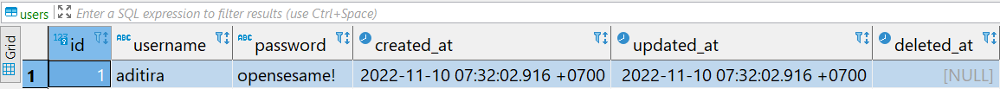

# ORM - GROM Assignment

## TODO List App with GORM

### Description

Disini kamu diminta untuk membuat aplikasi bernama todo app yang berfungsi untuk membuat list beserta status pekerjaan dari aktifitas yang kita kerjakan. Fitur yang yang harus dibuat dari aplikasi ini adalah:

- Register
- Login
- Create Todo list
- Read Todo list
- Change Status Todo List
- Remove Todo List

Buatlah chain middleware untuk menghandle Method dan Authentication dengan menggunakan metode session based token lalu simpan semua data user dan todo list di database **PostgresSQL** menggunakan **GORM**.

### Constraints

Berikut adalah hal-hal yang harus diperhatikan dalam mengerjakan aplikasi todo app ini:

📁 **repository**

Ini adalah fungsi yang berinteraksi dengan database postgres

- **users**
  - method `AddUser(user model.User)`: menerima parameter bertipe `model.User` dan berfungsi menyimpan data sesuai parameter tersebut ke tabel `users`
  - method `UserAvail(user model.User)`: menerima parameter bertipe `model.User` dan berfungsi memeriksa ketersediaan data pada tabel `users` dengan ketentuan:
    - check berdasarkan field `username` dan `password` dari parameter yang diterima.
    - kembalikan `error` jika tidak ada
    - kembalikan `nil` jika ada
- **sessions**
  - method `AddSessions(session model.Session)`: menerima parameter bertipe `model.Session` dan berfungsi menyimpan data sesuai parameter tersebut ke tabel `sessions`
  - method `UpdateSessions(session model.Session)`: menerima parameter bertipe `model.Session` dan berfungsi mengubah data session sesuai parameter tersebut ke tabel `sessions` dengan kondisi sama antara username parameter dengan database.
  - method `DeleteSession(token string)`: menerima parameter bertipe `string` dan berfungsi menghapus data tabel `sessions` sesuai dengan target token dari parameter yang diterima.
  - method `SessionAvailToken(token string)`: menerima parameter bertipe `string` dan berfungsi memeriksa apakah token tersedia pada tabel `sessions` sesuai dengan kolom **token** sama dengan nilai dari parameter.
    - jika session ditemukan, maka kembalikan data session dalam bentuk `model.Session` dan error `nil`
    - jika session **tidak** ditemukan, maka kembalikan data session kosong dalam bentuk `model.Session{}` dan error message
  - method `TokenValidity(token string)`: menerima parameter bertipe `string` dan berfungsi untuk melakukan check apakah token valid atau tidak, yang memiliki tahapan sebagai berikut:
    - check apakah token tersedia dengan fungsi `SessionAvailToken(token string)`
    - jika tersedia, check apakah token expired dengan fungsi `TokenExpired(session model.Session)`
      - jika session valid, maka kembalikan data session dalam bentuk `model.Session` dan error `nil`
      - jika session **tidak** valid, maka kembalikan data session kosong dalam bentuk `model.Session{}` dan error message
  - method `SessionAvailName(name string)`: menerima parameter bertipe `string` dan berfungsi memeriksa apakah token tersedia pada tabel `sessions` sesuai dengan kolom **name** sama dengan nilai dari parameter.
    - jika session ditemukan, maka kembalikan data session dalam bentuk `model.Session` dan error `nil`
    - jika session **tidak** ditemukan, maka kembalikan data session kosong dalam bentuk `model.Session{}` dan error message
- **todo**
  - method `AddTodo(todo model.Todo)`: menerima parameter bertipe `model.Todo` dan berfungsi menyimpan data sesuai parameter tersebut ke tabel `todos`
  - method `ReadTodo()`: menampilkan semua data pada tabel `todos` di database dalam bentuk model `[]model.Todo`, tampilkan semua kolom pada tabel tersebut dengan kondisi kolom `deleted_at` adalah `NULL`.
  - method `UpdateDone(id uint, status bool)`: menerima parameter **id** dengan _type_ `uint` dan **status** dengan _type_ `bool` dan berfungsi untuk mengubah data `todos` column `status` dari parameter sesuai dengan dengan `id` yang diterima. mengubah kolom `done` pada tabel sesuai dengan perameter yang diterima.
  - method `DeleteTodo(id uint)`: menerima parameter **id** dengan _type_ `uint` dan berfungsi untuk menghapus data `todoss` sesuai dengan dengan `id` yang diterima.

### **Perhatian**

Sebelum kalian menjalankan `grader-cli test`, pastikan kalian sudah mengubah database credentials pada file **`main.go`** (line 12) dan **`main_test.go`** (line 21) sesuai dengan database kalian. Kalian cukup mengubah nilai dari  `"username"`, `"password"` dan `"database_name"`saja.

Contoh:

```go
dbCredentials = Credential{
    Host:         "localhost",
    Username:     "postgres", // <- ubah ini
    Password:     "postgres", // <- ubah ini
    DatabaseName: "kampusmerdeka", // <- ubah ini
    Port:         5432,
}
```

### Test Case Example

#### Contoh _test case_ `users.go` method `AddUser(user model.User)`

**Input**:

```go
model.User{
  Username: "aditira",
  Password: "opensesame!",
}
```

**Expected Output / Behavior**:



**Explanation**:

> Data akan ditambahkan ke tabel `users` dengan field `id`, `created_at`, `updated_at` dan `deleted_at` ditambahkan otomatis dengan **gorm.Model**

#### Contoh _test case_ `users.go` method `UserAvail(user model.User)`

**Input**:

```go
// Jika user tidak ditemukan:
model.User{}

// Jika user ditemukan:
model.User{
  Username: "aditira",
  Password: "opensesame!",
}

```

**Expected Output / Behavior**:

```go
// Jika user tidak ditemukan tamplilkan error message:
"record not found"
// Jika user ditemukan:
nil
```

**Explanation**:

>Data akan ditambahkan ke tabel `users` dengan field `id`, `created_at`, `updated_at` dan `deleted_at` ditambahkan otomatis dengan **gorm.Model**
