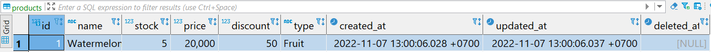
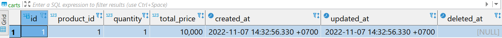
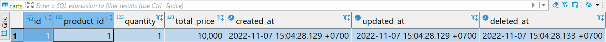
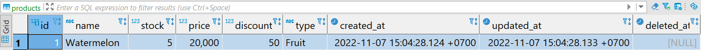

# Final Project - Database Management with GORM

## Cashier App 2

### Description

Disini kamu diminta untuk melakukan pengembangan dari final project sebelumnya yaitu **Cashier App** yaitu, kita akan melakukan perubahan metode penyimpanan data menggunakan database **PostgreSQL**. Tentunya kita berinteraksi dengan database menggunakan **GORM**.

Terdapat aplikasi yang kamu bisa jalankan di project ini dengan perintah `go run main.go` yang akan menjalankan aplikasi web di port `8080`. Disini sudah disediakan API dan endpoint yang bisa kita buka di browser untuk UI dari aplikasi ini.

Namun terdapat layer repository yang kamu haru lengkapi agar aplikasi cashier app ini bisa berinteraksi dengan database dengan spesifikasi yang telah ditentukan.

### Constraints

Berikut adalah spesifikasi yang harus diperhatikan dalam mengerjakan aplikasi cashier app ini:

📁 **repository**

Ini adalah fungsi yang berinteraksi dengan database postgres

- **users.go**
  - method `AddUser(user model.User)`: menerima parameter bertipe `model.User` dan berfungsi menyimpan data sesuai parameter tersebut ke tabel `users`
  - method `UserAvail(user model.User)`: menerima parameter bertipe `model.User` dan berfungsi memeriksa ketersediaan data pada tabel `users` dengan ketentuan:
    - check berdasarkan field `username` dan `password` dari parameter yang diterima.
    - kembalikan `error` jika tidak ada
    - kembalikan `nil` jika ada
- **sessions.go**
  - method `AddSessions(session model.Session)`: menerima parameter bertipe `model.Session` dan berfungsi menyimpan data sesuai parameter tersebut ke tabel `sessions`
  - method `UpdateSessions(session model.Session)`: menerima parameter bertipe `model.Session` dan berfungsi mengubah data session sesuai parameter tersebut ke tabel `sessions` dengan kondisi sama antara username parameter dengan database.
  - method `DeleteSession(token string)`: menerima parameter bertipe `string` dan berfungsi menghapus data tabel `sessions` sesuai dengan target token dari parameter yang diterima.
  - method `SessionAvailToken(token string)`: menerima parameter bertipe `string` dan berfungsi memeriksa apakah token tersedia pada tabel `sessions` sesuai dengan kolom **token** sama dengan nilai dari parameter.
    - jika session ditemukan, maka kembalikan data session dalam bentuk `model.Session` dan error `nil`
    - jika session **tidak** ditemukan, maka kembalikan data session kosong dalam bentuk `model.Session{}` dan error message
  - method `TokenValidity(token string)`: menerima parameter bertipe `string` dan berfungsi untuk melakukan check apakah token valid atau tidak, yang memiliki tahapan sebagai berikut:
    - check apakah token tersedia dengan fungsi `SessionAvailToken(token string)`
    - jika tersedia, check apakah token expired dengan fungsi `TokenExpired(session model.Session)`
      - jika session valid, maka kembalikan data session dalam bentuk `model.Session` dan error `nil`
      - jika session **tidak** valid, maka kembalikan data session kosong dalam bentuk `model.Session{}` dan error message
  - method `SessionAvailName(name string)`: menerima parameter bertipe `string` dan berfungsi memeriksa apakah token tersedia pada tabel `sessions` sesuai dengan kolom **name** sama dengan nilai dari parameter.
    - jika session ditemukan, maka kembalikan data session dalam bentuk `model.Session` dan error `nil`
    - jika session **tidak** ditemukan, maka kembalikan data session kosong dalam bentuk `model.Session{}` dan error message
- **producs.go**
  - method `AddProduct(product model.Product)`: menerima parameter bertipe `model.Product` dan berfungsi menyimpan data sesuai parameter tersebut ke tabel `products`
  - method `ReadProducts()`: menampilkan semua data pada tabel `products` di database dalam bentuk model `[]model.Product`, tampilkan semua kolom pada tabel tersebut dengan kondisi kolom `deleted_at` adalah `NULL`.
  - method `UpdateProduct(id uint, product model.Product)`: menerima parameter **id** dengan _type_ `uint` dan **product** dengan _type_ `model.Product` dan berfungsi untuk mengubah data `products` berdasarka `id` yang diterima. mengubah record pada tabel sesuai dengan perameter **product**.
  - method `DeleteProduct(id uint)`: menerima parameter **id** dengan _type_ `uint` dan berfungsi untuk menghapus data `products` sesuai dengan dengan `id` yang diterima.
- **carts.go**
  - method `AddCart(model.Product)`:  menerima parameter bertipe `model.Product` dan berfungsi untuk menambahkan data product ke tabel `carts` yaitu `product_id`, `quantity` dan menambahkan `total_price` yang sudah di kalkulasi dengan nilai discount pada product yang dipilih. Ada beberapa aturan yang harus digaris bawahi dari method ini yaitu:
    - Jika menambahkan product yang belum ada di tabel chart berdasarkan product id, maka ini akan **menambahkan** 1 data cart baru dan mengurangi jumlah `stock` pada data di tabel products tersebut.
    - Jika menambahkan product yang sudah ada di tabel chart berdasarkan product id, maka ini akan melakukan **update** pada field quantity dan total price di tabel carts dan mengurangi jumlah `stock` pada data di tabel products tersebut.

      > **Penting!**: pastikan saat menambahkan cart harus mengurangi jumlah stock pada tabel products. Jadi disarankan menggunakan Transaction.
  - method `ReadCart()`: menampilkan data cart dan di kombinasikan dengan data product dalam bentuk model `[]model.Join{}`, jadi ini akna menampilkan field `carts.id`, `carts.product_id`, `products.name`, `carts.quantity`, `carts.total_price`.
  - method `UpdateCart(id uint, cart model.Cart)`: menerima parameter **id** dengan _type_ `uint` dan **cart** dengan _type_ `model.Cart` dan berfungsi untuk mengubah data `carts` berdasarka `id` yang diterima. mengubah record pada tabel sesuai dengan perameter **product**.
  - method `DeleteCart(id uint, productID uint)`: menerima parameter **id** dengan _type_ `uint` dan **productID** dengan _type_ `uint`, ini berfungsi untuk menghapus data `carts` sesuai dengan dengan **id** yang diterima dan mengembalikan stock dari quantity di cart pada tabel `products` sesuai dengan **productID**:
    - Saat melakukan penghapusan data cart, ini juga harus mengembalikan jumlah quantity yang ada pada data cart ke data product.

      > **Penting!**: pastikan pengembalian quantity berhasil saat melakukan penghapusan data cart. Jadi disarankan menggunakan Transaction.

### **Perhatian**

Sebelum kalian menjalankan program, pastikan kalian sudah mengubah database credentials pada file **`main.go`** (line 12) dan **`main_test.go`** (line 20) sesuai dengan database kalian. Kalian cukup mengubah nilai dari  `"username"`, `"password"` dan `"database_name"`saja.

Contoh:

```go
dbCredentials = Credential{
    Host:         "localhost",
    Username:     "postgres", // <- ubah ini
    Password:     "postgres", // <- ubah ini
    DatabaseName: "kampusmerdeka", // <- ubah ini
    Port:         5432,
}
```

### Test Case Example

#### Test Case 1

**Input**:

```go

product := model.Product{
  Name:     "Watermelon",
  Price:    20000,
  Stock:    5,
  Discount: 50,
  Type:     "Fruit",
}

AddProduct(product)
```

**Expected Output / Behavior**:



#### Test Case 2

**Input**:

```go
product := model.Product{
  Model: gorm.Model{
    ID: 1,
  },
  Name:     "Watermelon",
  Price:    20000,
  Stock:    5,
  Discount: 50,
  Type:     "Fruit",
}
AddCart(product)
```

**Expected Output / Behavior**:



- Product Stock Updated:


#### Test Case 3

**Input**:

```go
res, _ := cartRepo.ReadCart()
fmt.Println(res)
```

**Expected Output / Behavior**:

```go
[]model.JoinCart{
  {
    Id: 1,
    ProductId: 1,
    Name: "Watermelon",
    Quantity: 1,
    TotalPrice: 10000
  }
}
```

```bash
[{1 1 Watermelon 1 10000}]
```

#### Test Case 4

**Input**:

```go
cartID := uint(1)
productID := uint(1)

DeleteCart(cartID, productID)
```

**Expected Output / Behavior**:

- Delete record cart dengan target id yang telah ditentukan:



- Kembalikan nilai stock product sesuai dengan quantity di cart:


