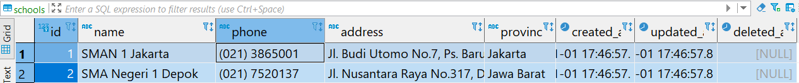

# GORM

## Basic CRUD with Termminal App

### Description

Pada exercise ini terdapat data model yang akan kita olah dengan **GORM** yaitu Student, Teacher, School, Class dan Lesson. Sederhanya yang akan kita buat yaitu kita akan belajar melakukan konsep CRUD menggunakan GORM dengan menggunakan database Postgre.

### Constraints

Yang akan kita kerjakan di exercise ini adalah di layer **repo** dengan ketentuan sebagai berikut:

📁 **repo**

- file `schools.go`
  - method `Init(data []model.School)`: menerima parameter bertipe **[]model.School** dan berfungsi menyimpan data sesuai parameter tersebut ke table di database.
- file `classes.go`
  - method `Init(data []model.Class)`: menerima parameter bertipe **[]model.Class** dan berfungsi menyimpan data sesuai parameter tersebut ke table di database.
- file `lessons.go`
  - method `Init(data []model.Lesson)`: menerima parameter bertipe **[]model.Lesson** dan berfungsi menyimpan data sesuai parameter tersebut ke table di database.
- file `teachers.go`
  - method `Save(data model.Teacher)`: menerima parameter bertipe **model.Teacher** dan berfungsi menyimpan data sesuai parameter tersebut ke table.
  - method `Query()`: menampilkan semua data pada tabel `teachers` di database dalam bentuk model **[]model.Teacher** pada tabel `teachers`, tampilkan semua column pada tabel tersebut (hint: `.Select(*)`).
  - method `Update(id uint, name string)`: menerima parameter **id** dengan _type_ `uint` dan **name** dengan _type_ `string`. Method ini berfungsi untuk mengubah data `teachers` column `name` dari parameter pada data di table yang memiliki `id` sama dengan `id` yang diterima melalui parameter.
  - method `Delete(id uint)`: menerima parameter **id** dengan _type_ `uint`. Method ini berfungsi untuk menghapus data `teachers` sesuai dengan dengan `id` yang diterima.

Pada masing-masing struct di repository telah terdapat __field__ `db` bertipe `*gorm.DB`. Manfaatkanlah __field__ ini untuk melakukan operasi ke database.

### **Perhatian**

Sebelum kalian menjalankan `grader-cli test`, pastikan kalian sudah mengubah database credentials pada file **`main.go`** (line 18) dan **`main_test.go`** (line 14) sesuai dengan database kalian. Kalian cukup mengubah nilai dari  `"username"`, `"password"` dan `"database_name"`saja.

Contoh:

```go
dbCredentials = Credential{
    Host:         "localhost",
    Username:     "postgres", // <- ubah ini
    Password:     "postgres", // <- ubah ini
    DatabaseName: "kampusmerdeka", // <- ubah ini
    Port:         5432,
}
```

### Test Case

#### Contoh _test case_ `schools.go` method `Init(input)`

**Input**:

```go
School{
    {
        Name:     "SMAN 1 Jakarta",
        Phone:    "(021) 3865001",
        Address:  "Jl. Budi Utomo No.7, Ps. Baru, Kecamatan Sawah Besar, Kota Jakarta Pusat, Daerah Khusus Ibukota Jakarta 10710",
        Province: "Jakarta",
    },
    {
        Name:     "SMA Negeri 1 Depok",
        Phone:    "(021) 7520137",
        Address:  "Jl. Nusantara Raya No.317, Depok Jaya, Kec. Pancoran Mas, Kota Depok, Jawa Barat 16432",
        Province: "Jawa Barat",
    },
}
```

**Expected Output Database Postgres `schools` Table**:



**Explanation**:

```txt
Data akan disimpan di tabel yang telah di migrasi sebelumnya sesuai dengan model School
```
