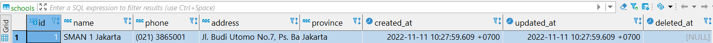

# ORM

## Join ORM CP

### Description

Pada exercise ini, kita akan melakukan join dari beberapa tabel yang akan kita inisialisasi datanya di awal yaitu tabel `schools`, `classes`, `lessons` dan `teachers`. Masing-masing tabel tersebut memiliki primary key pada kolom ID dan khusus untuk tabel `teachers` ini memiliki foreign key dari berdasarkan primary key dari tabel lainnya agar bisa saling berelasi dengan tabel lainnya.

### Constraints

Untuk mengerjakan exercise Join ini, kita harus mengerjakan semua method dibawah ini, dan berikut penjelasannya:

- File `main.go`
  - Method `(s School) Init(db *gorm.DB) error`: dipanggil dari struct `School` dan menerima parameter bertipe `*gorm.DB` dan berfungsi menyimpan data dari struct sesuai pada tabel `schools` di database
    - kembalikan error jika ada
    - kembalikan `nil` jika tidak ada error
  - Method `(c Class) Init(db *gorm.DB) error`: dipanggil dari struct `Class` dan menerima parameter bertipe `*gorm.DB` dan berfungsi menyimpan data dari struct sesuai pada tabel `classes` di database
    - kembalikan error jika ada
    - kembalikan `nil` jika tidak ada error
  - Method `(l Lesson) Init(db *gorm.DB) error`: dipanggil dari struct `Lesson` dan menerima parameter bertipe `*gorm.DB` dan berfungsi menyimpan data dari struct sesuai pada tabel `schools` di database
    - kembalikan error jika ada
    - kembalikan `nil` jika tidak ada error
  - Method `(t Teacher) Init(db *gorm.DB) error`: dipanggil dari struct `Teacher` dan menerima parameter bertipe `*gorm.DB` dan berfungsi menyimpan data dari struct sesuai pada tabel `schools` di database
    - kembalikan error jika ada
    - kembalikan `nil` jika tidak ada error
  - Method `(t Teacher) Join(db *gorm.DB) ([]Joined, error)`:  dipanggil dari struct `Teacher` dan menerima parameter bertipe `*gorm.DB` dan berfungsi menampilkan data `teacher_name` (dari kolom `name` pada _table_ `teachers`), `school_name` (dari kolom `name` pada _table_ `schools`), `class_name` (dari kolom `name` pada _table_ `classes`) dan `lesson_name` (dari kolom `name` pada _table_ `lessons`) dalam bentuk struct **Joined**. Kalian perlu melakukan join antara _table_ `teachers` dengan 3 table lainnya yaitu `schools`, `classes`, dan `lessons` (join semua _table_ dalam 1 query saja).
    - kembalikan data `Joined{}` dan error jika ada
    - kembalikan data `Joined` dan `nil` jika tidak ada error

### **Perhatian**

Sebelum kalian menjalankan `grader-cli test`, pastikan kalian sudah mengubah database credentials pada file **`main.go`** dan **`main_test.go`** sesuai dengan database kalian. Kalian cukup mengubah nilai dari  `"username"`, `"password"` dan `"database_name"`saja.

Contoh:

```go
dbCredentials = Credential{
    Host:         "localhost",
    Username:     "postgres", // <- ubah ini
    Password:     "postgres", // <- ubah ini
    DatabaseName: "kampusmerdeka", // <- ubah ini
    Port:         5432,
}
```

### Test Case Examples

#### Contoh _test case_ method `(s School) Init(db *gorm.DB) error`

**Input**:

```go
School{
    Name:     "SMAN 1 Jakarta",
    Phone:    "(021) 3865001",
    Address:  "Jl. Budi Utomo No.7, Ps. Baru, Kecamatan Sawah Besar, Kota Jakarta Pusat, Daerah Khusus Ibukota Jakarta 10710",
    Province: "Jakarta",
}
school.Init(dbConnection)
```

**Expected Output Database Postgres `schools` Table**:



**Explanation**:

```txt
Data akan disimpan di tabel yang telah di migrasi sebelumnya sesuai dengan model School
```

#### Contoh _test case_ method `(t Teacher) Join(db *gorm.DB) ([]Join, error)`

**Input**:

```go
teacher := Teacher{
    Name: "Aditira",
    ...
}
teacher.Join(dbConn)
```

**Expected Output**:

```bash
{Aditira SMAN 1 Jakarta IPA - 1 Matematika}
```

**Explanation**:

```txt
Melakukan join data teacher dengan data school, class, dan lesson dan menampilkan data teachers.name, schools.name, classes.name, lessons.name dari tabel yang bersangkutan dan di scan ke struct Join, kemudian dikembalikan sebagai respon dari method.
```
